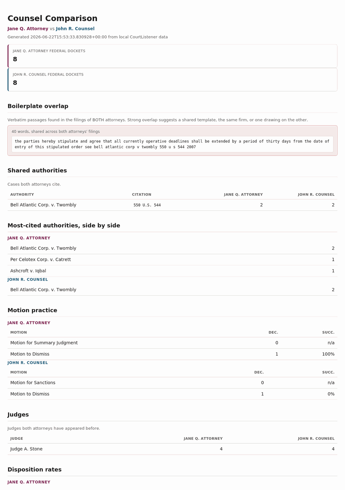
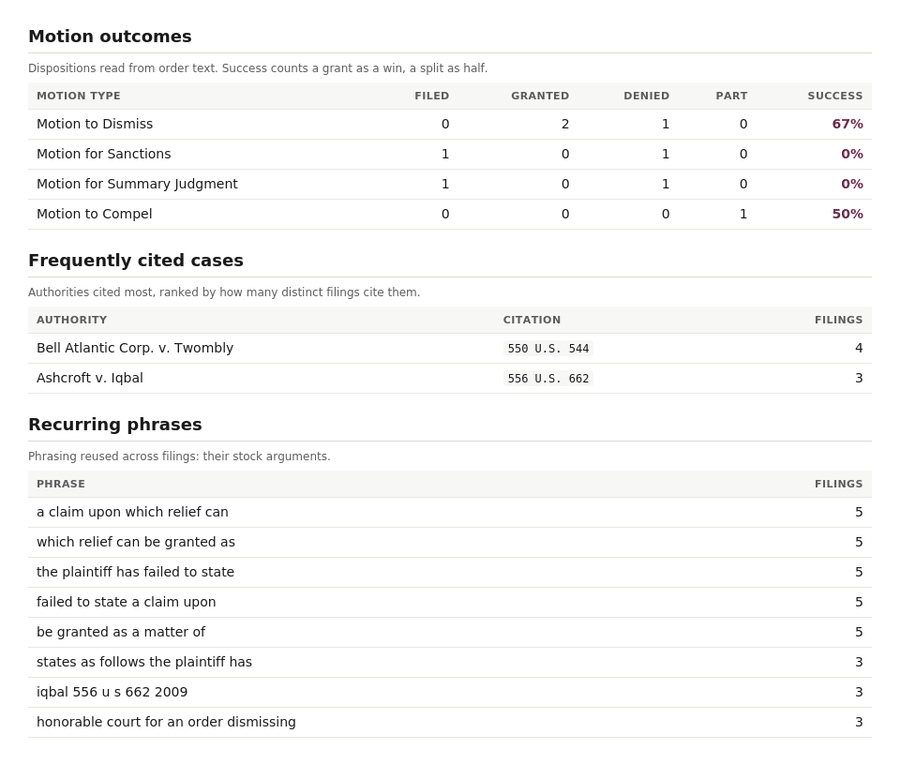
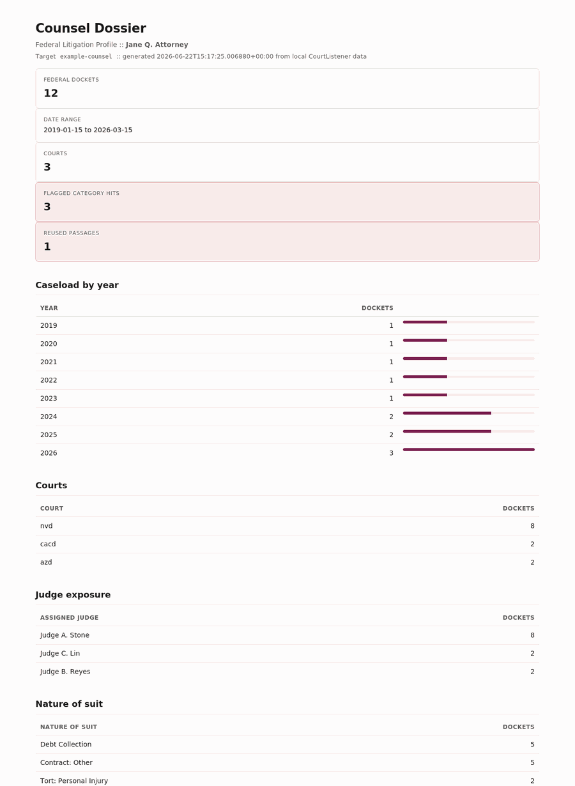

# Counsel Dossier

**Federal Litigation Profile Toolkit**

_Designed by PinkViper Labs._



Counsel Dossier builds a litigation profile of any attorney from public federal court records. Point it at an attorney, and it pulls their dockets from CourtListener into a local SQLite database, then produces a profile: caseload by year and court, the judges they appear before, nature of suit, dispositions, a configurable classifier for things like sanction or Rule 11 language in order text, and a boilerplate detector that finds language the attorney reuses verbatim across filings. The output is a standalone HTML dossier plus the queryable database.

Bring your own credential. Counsel Dossier ships no token and no database. It runs entirely on your machine against the public CourtListener API, and the only thing you supply is your own free API token.

## Why use this?

Use public court records to:

- Profile opposing counsel's federal caseload, courts, and judge relationships before you ever walk into a hearing
- Surface sanction, Rule 11, frivolousness, or fee-award language in orders that name an attorney
- Detect boilerplate: the passages an attorney files verbatim across many cases
- Quantify patterns over time and generate a clean, shareable dossier

It runs locally against a public API. Nothing leaves your machine except your own queries to CourtListener.

## Screenshots

The litigation analytics (motion outcomes, cited cases, recurring phrasing):



The full HTML dossier:



## Install

```
git clone https://github.com/jaderileyburch/counsel-dossier.git
cd counsel-dossier
python -m venv .venv
source .venv/bin/activate
pip install -r requirements.txt
```

On Windows, activate with `.venv\Scripts\activate`. Requires Python 3.10 or newer.

## Get a token

The CourtListener v4 API requires authentication. Create a free account at courtlistener.com, copy the API token from your profile, and set it as an environment variable:

```
export COURTLISTENER_TOKEN=your_token_here
```

The token is read from the environment only. It is never written to disk and never committed.

## Quick start

```
python cli.py init
python cli.py pull example-counsel --with-docs
python cli.py classify example-counsel
python cli.py fingerprint example-counsel
python cli.py analytics example-counsel
python cli.py profile example-counsel
python cli.py report example-counsel
```

Edit `config/targets/example-counsel.yaml` (or copy `_template.yaml`) to point at a real attorney first. Outputs land under `exports/<target_id>/`.

## Commands

| Command | What it does |
|---|---|
| `init` | Create or upgrade the SQLite schema |
| `targets` | List available target configurations |
| `pull <target_id>` | Pull federal dockets for the target attorney from CourtListener |
| `classify <target_id>` | Run the target's taxonomy across pulled order/opinion text |
| `fingerprint <target_id>` | Detect reused/boilerplate language across pulled documents |
| `analytics <target_id>` | Motion outcomes, frequently cited cases, and recurring phrases |
| `compare <a> <b>` | Side-by-side comparison of two attorneys |
| `profile <target_id>` | Print the dossier summary to the terminal |
| `report <target_id>` | Generate a standalone HTML dossier |
| `renormalize` | Recompute canonical attorney names after editing aliases |
| `status` | Show row counts and recent pulls |

All commands accept `--db`, `--targets-dir`, and `--aliases` before the subcommand.

## Defining a target

Copy `config/targets/_template.yaml` to `config/targets/<your_target>.yaml`. A target defines the attorney to search for, optional court and date filters, a classification taxonomy, and fingerprint settings.

The taxonomy is a keyword and regex tagger. Each category produces a yes/no flag per text item, with `min_matches` controlling how many distinct patterns must hit. The default template ships a sanctions category (sanction, Rule 11, bad faith, frivolous, fee award) and a discovery-abuse category.

## How the pull works

`pull` searches CourtListener for dockets where the attorney appears, then stores docket metadata locally. With `--with-parties` (on by default) it also records the parties and co-counsel per docket. With `--with-docs` it pulls the text of documents that are already in the RECAP Archive, which is free and is what the fingerprinter needs.

Documents not yet in the RECAP Archive have no text available over the API. Fetching those would require purchasing them from PACER with your own PACER credential, which costs money per page. Counsel Dossier does not buy documents for you; it works with what is already public in the archive. Wiring up PACER purchases through CourtListener's `recap-fetch` endpoint is a documented extension point, not a default.

## Attorney name normalization

CourtListener attorney records are extracted per docket, so the same lawyer can appear under several spellings. `config/aliases.yaml` collapses known variants into one canonical name. Honorifics and trailing credentials like ", Esq." are stripped automatically. After editing the alias file, run `python cli.py renormalize` to recompute existing rows.

## Boilerplate detection

`fingerprint` reduces each pulled document to a set of hashed word shingles, flags near-duplicate documents by Jaccard similarity, and extracts the longest verbatim passages shared across filings. It aggregates each passage across the corpus so you can see, for example, that one paragraph appears word for word in a dozen of the attorney's motions. Comparison is pairwise, which is fine for a single attorney's corpus; for very large sets, raise the similarity threshold or filter by court or year first.

## Litigation analytics (the playbook)

`analytics` runs three deterministic analyzers over the pulled document text. No models, just pattern matching, so every number traces back to a specific filing you can open and verify.

- **Motion outcomes.** Filings are classified into motion types, and disposition language (granting, denying, granting in part) is read out of order text. Each motion type gets granted, denied, and partial counts plus a success rate, where a grant counts as a win and a split as half. Important caveat: the success rate reflects how a motion type fared in this attorney's dockets, and it does not by itself prove the attorney was the movant on each one. Treat it as a lead to verify against the docket, not a certified personal win rate.
- **Frequently cited cases.** Reporter citations are extracted from filing text and ranked by how many distinct filings cite them, with a best-effort capture of the case name. This is the spine of what the attorney argues. The dossier also breaks this down by motion type, so you can see what they cite specifically in their motions to dismiss versus their summary judgment motions. For higher-fidelity citation parsing you can swap in the Free Law Project's eyecite library; the regex extractor here keeps the tool dependency-light by default.
- **Recurring phrases.** The multi-word phrases an attorney reuses across filings, ranked by how many distinct filings contain them. This is the short-grain companion to the verbatim boilerplate detector: it surfaces habitual phrasing and stock arguments even when the surrounding paragraph differs. Overlapping windows of the same sentence are collapsed so the list reads cleanly.

Together these answer the question that matters before a hearing: what is this attorney likely to file, what will they cite, and how has it worked out.

## Opposing counsel comparison

`compare <target_a> <target_b>` puts two already-pulled attorneys head to head and writes a side-by-side HTML report. Both targets must be pulled and analyzed first. The comparison covers:

- **Boilerplate overlap.** Verbatim passages that appear in BOTH attorneys' filings. Strong overlap is a real signal: a shared template, the same firm behind both, or one drawing on the other.
- **Shared authorities.** The cases both attorneys cite, with each one's filing counts.
- **Most-cited authorities side by side**, and **motion practice** with success rates for each.
- **Shared judges** they have both appeared before, and **disposition rates** for each.

This is the report people run the morning of a hearing. The repo ships a second example target (`example-opponent`) so `compare example-counsel example-opponent` works out of the box once both are pulled.

## Scope and limits

- **Federal only.** CourtListener carries federal courts and a limited set of state appellate courts. It does not carry most state trial courts. State coverage would require per-court scrapers, which this tool does not provide.
- **Attorney identity is fuzzy.** Names are matched on text, not a canonical entity, so use the alias map and review results.
- **Counts are floors.** Figures reflect only records present in your local data set.

## Development

```
pip install -r requirements-dev.txt
pytest
```

Tests cover the classifier, the fingerprinting logic, attorney normalization, and the database layer. None touch the network.

## Evidentiary framing

This tool aggregates public federal court records. Caseload and disposition figures come from docket metadata and the Federal Judicial Center Integrated Database. Classification flags reflect language found in text and are pointers for review, not adjudicated findings. Reused-passage detection shows verbatim overlap between an attorney's own filings; it is a fact about their drafting, not a legal conclusion.

## Data source

CourtListener / RECAP Archive, public REST API v4:
`https://www.courtlistener.com/api/rest/v4/`

API documentation: https://www.courtlistener.com/help/api/rest/

CourtListener and the RECAP Archive are projects of the Free Law Project.

## License

Released under the MIT License. See `LICENSE`.

## Disclaimer

This tool surfaces patterns in public court data. It is not legal advice. Use it for legitimate litigation research and competitive intelligence on the public professional record of attorneys.
